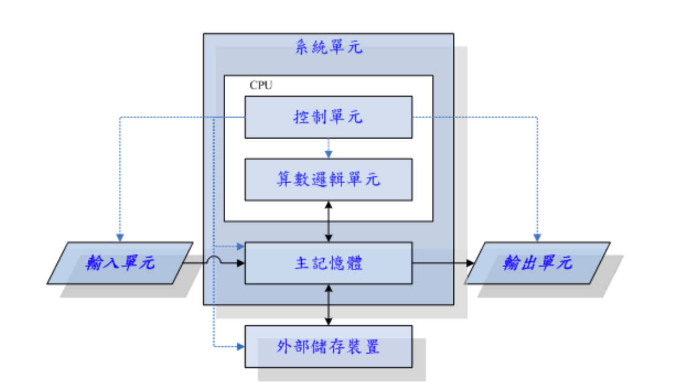

# 计算机概论

## 0.1 计算机：辅助人脑的好工具

### 0.1.1 计算机硬件的五大单元

计算机是由五个单元组成，包括输入单元、输出单元、CPU内部的控制单元、算数逻辑单元与主存储器。它们的相关性如下：

上面图表中的“系统单元”其实指的就是计算机的主要组件，而重点在于CPU和主存储器。注意实线部分的传输方向，__基本上数据都是流经主存储器再转出去的__！至于数据会流进/流出内存则是CPU所发布的控制命令！而CPU实际要处理的资料则完全来自于主存储器！

